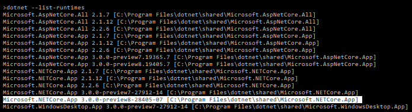
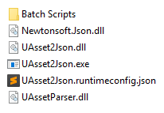
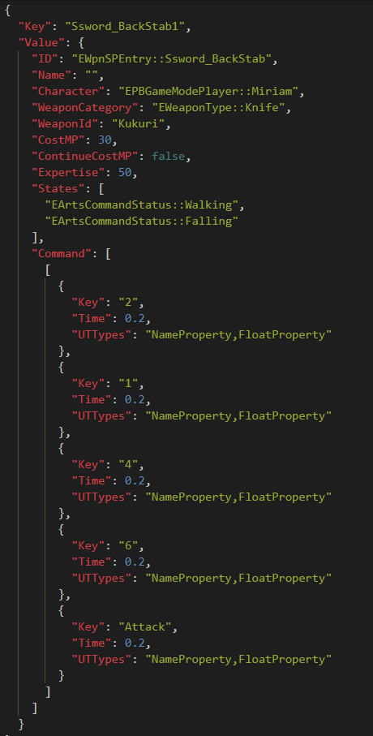
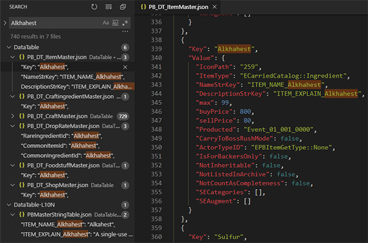
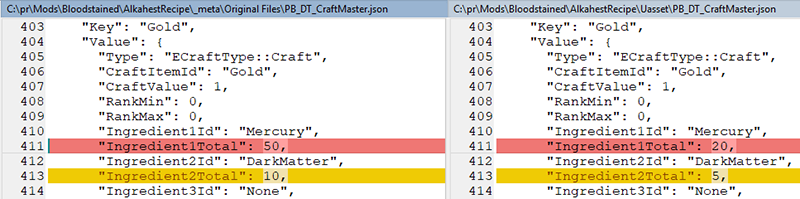
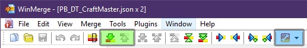
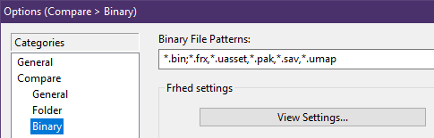

# Serializer Readme

Download Kein's serializer from the [Bloodstained Moders discord](http://discord.gg/b9XBH4f).

## Requirements

To run the serializer you'll need to download and install the .NET Core 3.0 Preview 8:

- [Download 64bit Installer](https://dotnet.microsoft.com/download/thank-you/dotnet-runtime-3.0.0-preview8-windows-x64-installer)
- [Download 32bit Installer](https://dotnet.microsoft.com/download/thank-you/dotnet-runtime-3.0.0-preview8-windows-x86-installer)

You can also download it from [here](https://dotnet.microsoft.com/download/dotnet-core/3.0) (under Runtime > .NET Core Installer).

### Check Runtime Installation

To confirm installation, open the command prompt and enter `dotnet --list-runtimes` (copy this then paste with right-click).

Look for this: `Microsoft.NETCore.App 3.0.0-preview8-****`

### CLI Options

See the command line options by running the serlializer without passing it a file/folder:

	USAGE:
	UAsset2Json <action1> [action2] [...] [path or file]

	EXAMPLE:
	UAsset2Json -tojson -dumpnames d:\assets\my.uasset

	ACTIONS:
	 -tojson        deserialize uasset(s) into JSON
	 -tobin         updates .uasset(s) with changes from JSON
	 -dumpnames     dumps all names from uasset into .names file
	 -dumpmeta      dumps some meta from uasset into .meta file
	 -instnums      adds instance numbers > 0 to FName values in JSON
	 -fullinst      adds instance numbers > 0 to every FName
	 -newentries    allow new entries (experimental, unstable)
	 -verbose       print warnings for some actions
	 -force         forces updating of complex arrays from JSON

You can specify either a single file, or a whole folder of other files. Files in subfolders will be processed too.

## Batch Scripts

The batch scripts let you drag and drop files/folders onto them for fast file processing.

**[Download Batch Scripts 1.1.0](https://github.com/ithinkandicode/bloodstained-tools/raw/master/Serializer/files/Batch%20Scripts%201.1.0.zip)**

### Where to put them

Move the _Batch Scripts_ folder into the same folder as the serializer.

You don't need to keep any these readme files.

### How to use them

Drag and drop files or folders into the batch script you want to use.

If you drop a folder, all the subfolders inside it will be processed too.

#### Uasset to JSON

  1. Drag and drop the file/folder containing UASSET files onto **1 - uasset to JSON.bat**
  1. JSON files will be created in the same folder as each uasset

#### JSON to Uasset (.bin)

  1. Make sure the original uasset files are in the same folder as their JSON files, and have the same filename
  1. Drag and drop the file/folder containing JSON files onto **2 - json to BIN.bat**
  1. Bin files will be created in the same folder as each JSON  (see [Bin Files](#bin-files) below)
  1. The original uasset file is left unchanged

#### JSON to Uasset: Updating Arrays

Some DataTables and their JSON files use arrays, which are sets of data within other sets.

If you change data within within an array, use **2 - json to BIN--force.bat**.

Example array:

#### JSON to Uasset: Adding Entries

If you add new entries, use **2 - json to BIN--force-newentries.bat**.

An example of adding entries would be appending _PB_DT_CheatCodeMaster_ to add new cheat codes.

Note: Always add new entries to the bottom of your JSON files. You cannot remove existing entries.

#### Bin Files

Bin files are uasset files, they just have a different file extension.

To use them as uassets, you can either:

  1. Change the file extension manually, from `.bin` to `.uasset`
  2. Use the bulk renamer batch script detailed below

You check your changes before renaming, you can compare bin vs. uasset a binary comparison tool (see [WinMerge](#winmerge) below).

#### Bin to Uasset

This batch script lets you rename uasset files in bulk.

  1. Drag and drop the file/folder containing BIN files onto  **3 - Rename bin to UASSET.bat**

**WARNING:** This process will delete the original uasset files, even if there is no bin file to replace it. Make sure you keep backups of the original uasset files as part of your modding workflow.

## Additional Tools

### JSON to CSV

Converting your JSON files to CSV lets you see all the data in an easily readable format, and lets you make lots of changes very quickly.

There is an excelent online tool for this. It can reverse the process too, and convert your CSV back to JSON.

- [JSON to CSV](http://www.convertcsv.com/json-to-csv.htm)
- [CSV to JSON](http://www.convertcsv.com/csv-to-json.htm)

To use either tool:

  1. Select a file from the **Choose File** tab
  1. Click the conversion button (either _JSON to CSV_ or _CSV to JSON_)
  1. Next to the **Download Result** button, enter the converted file's filename.
  1. Click the **Download Result** button

The downloaded filename is arbitrary, but it's a good idea to match the name of the uploaded JSON file.

You don't need to change any settings for either tool.

### VS Code

[VS Code](https://code.visualstudio.com/) is a popular code editor that can help you edit JSON files.

The main benefits to you as a modder are:

- Syntax highlighting for JSON files
- Quickly search in multiple files
- Find & replace (regex supported)

**[Download VS Code](https://code.visualstudio.com/Download)**

### WinMerge

[WinMerge](https://winmerge.org/) lets you compare two files, or a whole folder of files.

Click the buttons marked green to move to the next/previous change.

JSON file compare works out of the box, but uasset and bin files need to be compared as binary (hex).

To enable this, go to Options (marked blue in the screenshot above) and add `,*.uasset` to the list:

In this screenshot binary comparison has been enabled for `uasset`, `pak`, `sav` and `umap` files.

**[Download WinMerge](https://winmerge.org/downloads)**